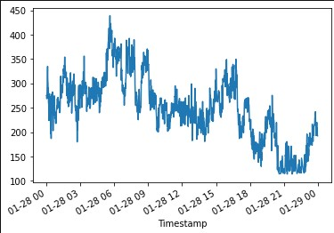

# Bitcoin Arbitrage Historical Analysis
---

## Overview and Purpose
This project is a Jupyter Notebook containing an analysis report of arbitrage opportunities between two Bitcoin markets, Bitstamp and Coinbase, using historical data from 2018. It is the weekly challenge for Module 3 of the UW Fintech Bootcamp, Financial Analysis With Pandas.

The purpose of this project is to demonstrate proficiency using Pandas for three steps of data analysis: collection, preparation, and statistical analysis/visualization.

## Process

### Data Collection
The data is imported into the program through the Pandas `read_csv` function, and saved to a dataframe.

```
bitstamp = pd.read_csv(
    #the CSV file is contained in the "resources" folder of the repository
    Path('./resources/bitstamp.csv'),
    #set the index header to "Timestamp"
    index_col='Timestamp',
    parse_dates=True,
    infer_datetime_format=True)
```


### Data Preparation
A series of steps are now taken to prepare the data for analysis:

* Drop missing values from the Dataframe:

```
bitstamp.isnull().sum()
bitstamp.isnull().mean()
bitstamp = bitstamp.dropna()
bitstamp.isnull().sum()
```

* Remove currency symbols from the data and convert the datatypes to `float`

```
bitstamp.loc[:, 'Close'] = bitstamp.loc[:, 'Close'].str.replace('$', '')
bitstamp.loc[:, 'Close'] = bitstamp.loc[:, 'Close'].astype('float')
```

* Check for duplicated values - there were no duplicated values in the dataset so there was no need to remove them

```
bitstamp.duplicated().sum()
```

### Data Analysis and Visualization

For this analysis, I only used data from the *Close* column of the DataFrame.

This section focused on analyzing targeted sections of the broader DataFrame using statistical analysis and visualization.

There are many data slices and visualizations in this section, but the one that I focused on the most was the data from January 28th, 2018. I chose this date because it was among those with the largest spread.


I also analyzed data from two other dates, but neither of them had a spread large enough to yield any potential profit.

#### Profit Calculation

The final section of the project consists of calculating the potential profits from the arbitrage opportunity and visualizing the resulting datasets.

The code `profit_early = profitable_trades_early * coinbase['Close'].loc['2018-01-28']` calculates the potential profits per trade throughout the day on January 28th, resulting in a dataset which can be shown in the following visualization.



`profit_early.sum()` calculates the total amount of potential profit from that day, which comes to $319,918.29

The final calculation is the cumulative sum of the potential profits throughout the day. The code for this is `profit_early.cumsum()` and results in the following visualization.


## Technologies
* JupyterLab and Jupyter Notebooks
* Python 3.9
* Python Pandas and the Path module from Pathlib

## Contributors
Lydia Ciummo - lydiaciummo@hotmail.com

## License
GNU General Public License v3.0